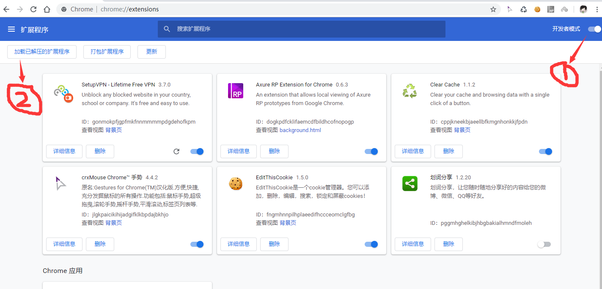
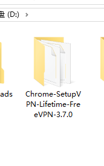
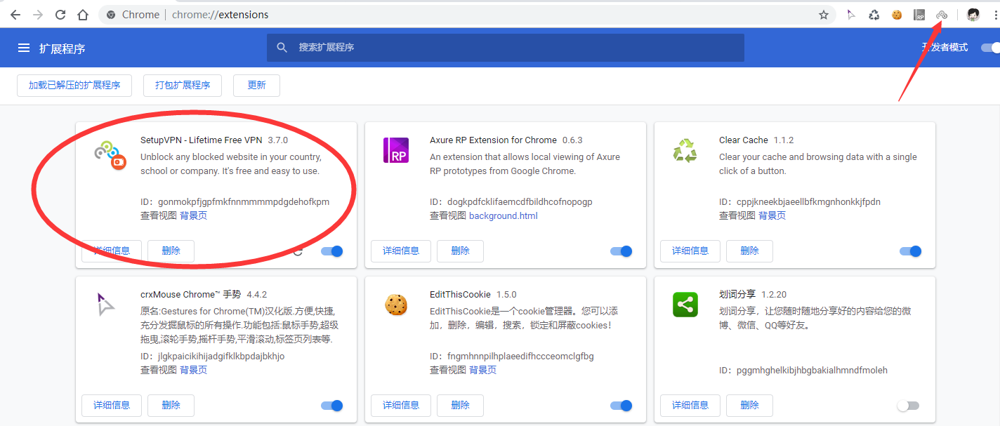
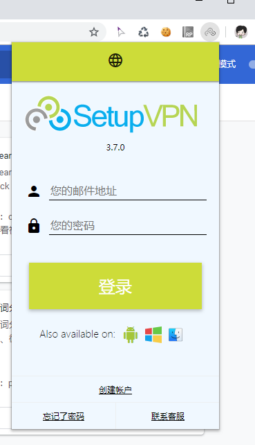
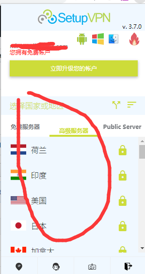

# Chrome-SetupVPN-Lifetime-FreeVPN-3.7.0

setupvpn for chrome 谷歌浏览器 FreeVPN-3.7.0 插件

# 安装

1.克隆或者直接下载  git clone or download zip(完成后需解压);

2.打开谷歌浏览器 直接地址栏输入 chrome://extensions/ 

3.打开开发者模式 --> 加载已解压的扩展程序

4.选择该文件夹

5.扩展程序中出现如图所示的图标，表示插件已安装成功

6.点击该扩展程序，然后注册账号 --> 登录账号 --> 选择要连接的vpn就可以了

